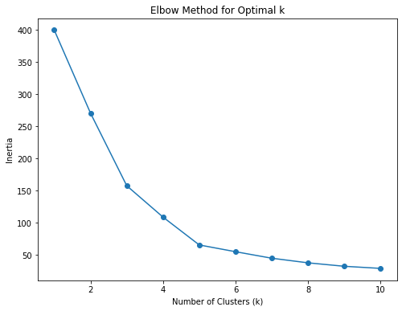
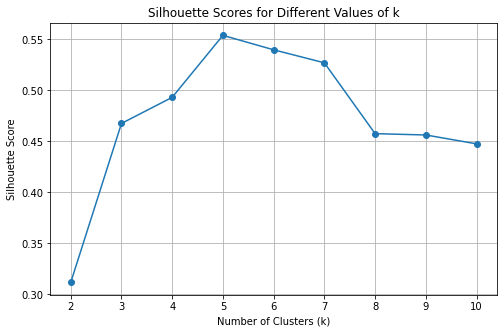
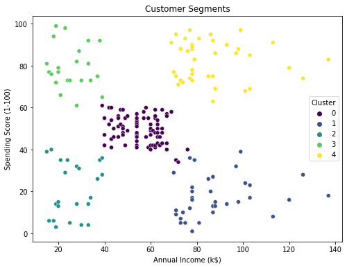

# Customer_Segmentation_Analysis
This project demonstrates customer segmentation using K-Means Clustering on the Mall Customers dataset. 

## Objective
To group customers into distinct clusters based on their spending behavior and income levels for targeted marketing strategies.

## Steps
1. Data Exploration and Preprocessing
2. Implementing K-Means Clustering
3. Determining Optimal Clusters Using Elbow Method and Silhouette Score
4. Visualizing Clusters
5. Interpreting Results

## Tools
- Python
- Libraries: pandas, numpy, matplotlib, seaborn, scikit-learn

## Results
The analysis identified 5 distinct customer segments based on their spending and income patterns. 
Detailed insights are in the `results` folder.

## Visualizations

## Dataset
The dataset is included in the `dataset` folder. It was sourced from [Kaggle](https://www.kaggle.com/datasets/shwetabh123/mall-customers?resource=download).
